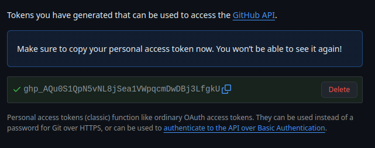
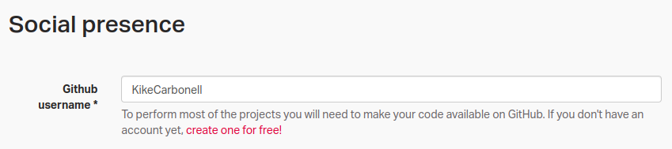
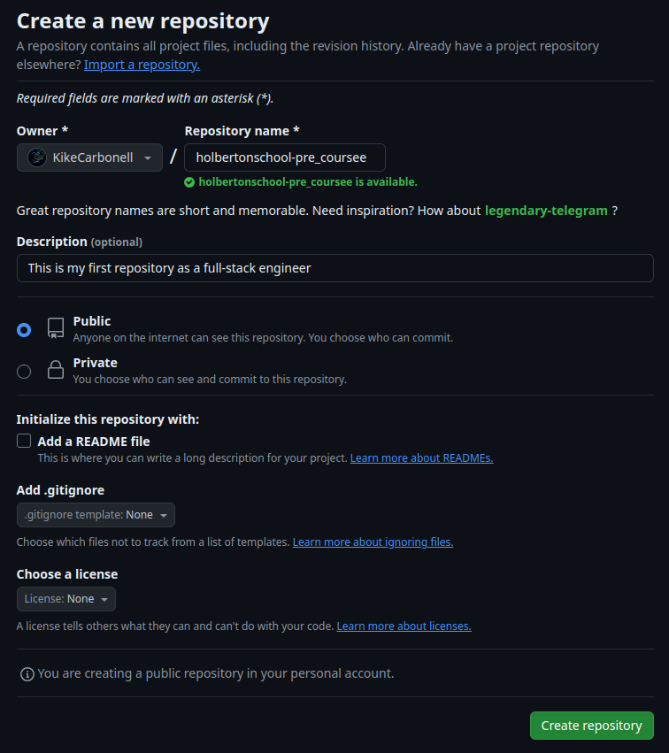

# 0. Create and setup your Git and GitHub account

**Step 0 - Create an account on GitHub**

You will need a GitHub account for all your projects. You can create an account for free here.https://github.com/

**Step 1 - Create a Personal Access Token on Github**

To have access to your repositories and authenticate yourself, you need to create a Personal Access Token on Github.
You can follow this tutorial to create a token.https://docs.github.com/en/authentication/keeping-your-account-and-data-secure/managing-your-personal-access-tokens

**Step 2 - Update your profile on the Intranet**

Update your Intranet profile by adding your Github username here
If it’s not done the Checker won’t be able to correct your work

**Step 3 - Create your first repository**

Using the graphic interface on the github website, create your first repository.

 - Name: Look at the bottom of the project to see the name of the repository
 - Description: This is my first repository as a full-stack engineer
 - Public repo
 - No README, .gitignore, or license

**Step 4 - Open the sandbox**

On the intranet, just under the task, click on the button ***>_ Get a sandbox*** and run to start the machine.

Once the container is started, click on ***>_ Webterm*** to open a shell where you can start work from.

**Step 5 - Clone your repository**

On the webterm of the sandbox, do the following:

 - Clone your repository

`git clone git@github.com:KikeCarbonell/holbertonschool-pre_course.git`

**Step 6 - Create the README.md and push the modifications**

 - Navigate to this new directory.

`cd holbertonschool-pre_course`

-Create the file `README.md` with the content `My first readme`.

 - Add this new file to git, commit the change with this message “My first commit” and push to the remote server / origin

`git add`
`git commit -m "My first commit"`
`git push`

Good job!
You pushed your first file in your `first repository`.
You can now check your repository on GitHub to see if everything is good.